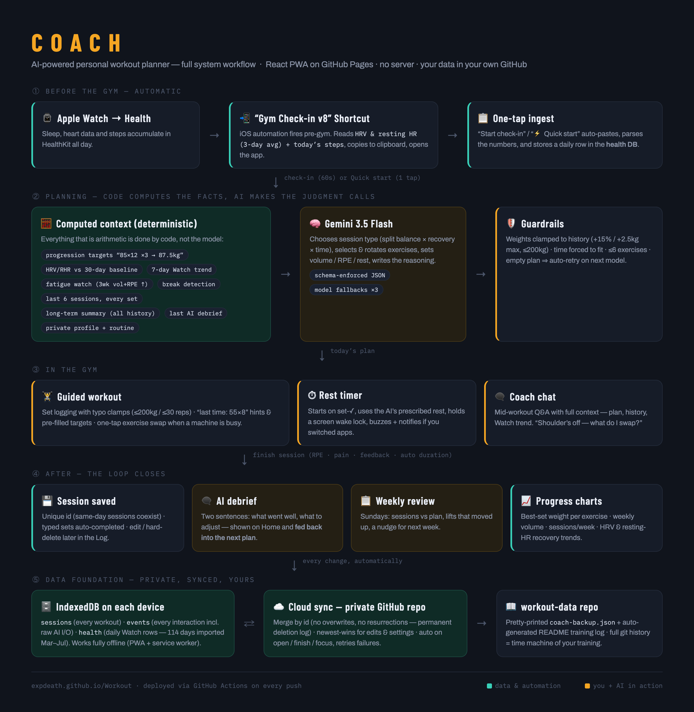

# 🏋️ COACH — AI-Powered Personal Workout Planner

A zero-friction daily training app: check in for 60 seconds (or one tap), and an AI coach builds today's session from your training history, Apple Watch recovery data, and computed progression math. Runs entirely in the browser — no server, installable as a PWA, works offline, and every byte of your data lives in your own private GitHub repo.

**Live app:** https://expdeath.github.io/Workout/

## How it works

## Highlights

- **Code computes the facts, AI makes the judgment calls** — progression targets, recovery baselines, and fatigue signals are deterministic; Gemini only chooses, balances, and adapts, inside strict guardrails
- **Apple Watch pipeline** — an iOS Shortcut automation delivers HRV, resting HR, and steps daily
- **Own your data** — sessions, health rows, and a full interaction log sync to a private GitHub repo with a human-readable training log; its git history is a time machine
- **Gym-proof** — offline PWA, wake-locked rest timer, last-time hints, one-tap exercise swaps, mid-workout coach chat

Built with React + Vite, hand-rolled SVG charts, IndexedDB, and the Gemini API.
